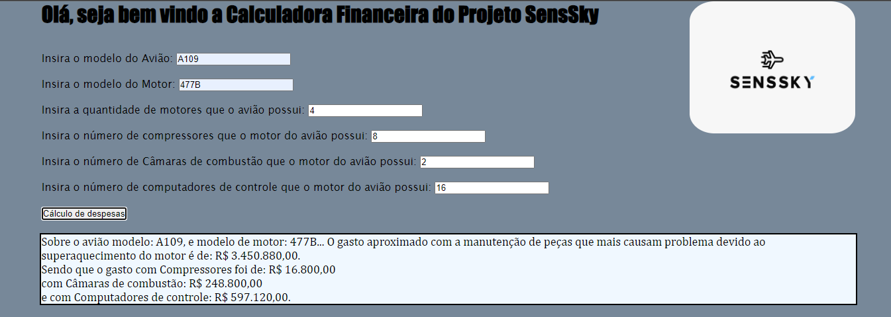
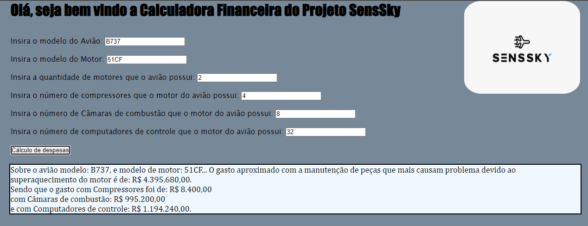

# Calculadora-Financeira
Calculadora financeira do Projeto SensSky.

Durante o uso dos motores de avião e com a falta de monitoramento da temperatura destes
é comum que haja um desgaste de peças cruciais para o bom desempelho da aeronave. Pensando 
nisso, foram escolhidas três peças do motor para compor o cálculo de despesas caso não haja
uma preocupação com este monitoramento : o compressor, câmara de combustão e computadores
de controle. 

Faixa aproximada de preços dos equipamentos:

R$ 700,00 - Compressor |
R$ 12.440,00 - Câmara de combustão |
R$ 3.732,00 - Computador de Controle

 Exemplos de Inputs:

 

 

referências: 

https://www.bing.com/search?q=quanto+custa+em+m%C3%A9dia+um+compressor+de+motor+de+aviao&form=QBLH&sp=-1&ghc=1&lq=0&pq=quanto+custa+em+m%C3%A9dia+um+compressor+de+motor+de+avia&sc=11-52&qs=n&sk=&cvid=CC7D2A0FACB947299BDB46C3A5D70A19&ghsh=0&ghacc=0&ghpl=

https://www.bing.com/search?q=quanto+custa+em+m%C3%A9dia+uma+camara+de+combustao+de+motor+de+aviao&qs=n&form=QBRE&sp=-1&lq=1&pq=quanto+custa+em+m%C3%A9dia+uma+camara+de+combustao+de+motor+de+aviao&sc=2-63&sk=&cvid=6F03C1FD0C9542C88D3868C5E38DB26F&ghsh=0&ghacc=0&ghpl=

